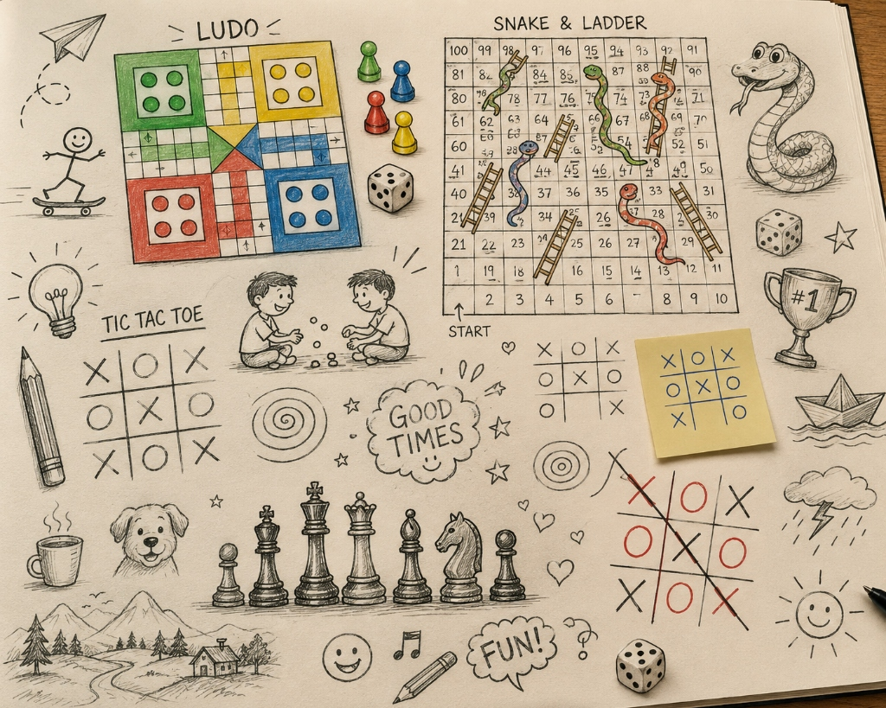

# 🎮 Game Zone Live

An interactive, real-time multiplayer gaming and chatting platform built with **React**, **TypeScript**, **Express**, and **Socket.IO**. Play games with friends, create room codes, share invite links, and chat live in a frosted glass lounge!



---

## 🌟 Featured Games & Modules

### 👑 1. Royal King's Advanger (3D Action Adventure)
- Reclaim the lost treasury of your ancestors in an immersive 3D kingdom adventure.
- High-performance web canvas rendering with action controls and full immersion.

### 🎨 2. Drawing Guess Game
- Real-time collaborative canvas for drawing secret words.
- Live hint updates, timers, correct guess detection, and leaderboard scoring.

### 🎲 3. Ludo Game
- Multiplayer 2 to 4 player classic Ludo.
- Custom token movement rules, safe zone handling, blockade rules, and turn synchronization.

### 🐍 4. Snake & Ladder Game
- Classic 2 to 4 player board game.
- Dynamic dice rolling, ladder climbs, snake traps, and real-time turn tracking.

### ❌ 5. XOX Game (Tic-Tac-Toe)
- Play traditional 3x3 Tic-Tac-Toe or expand grid sizes up to 8x8.
- Custom win detection logic and turn indicators.

### 💬 6. Group Chat Lounge (Glassmorphism Theme)
- Real-time room-based group chat with room codes and instant shareable invite links.
- **Glassmorphism Aesthetic**: Frosted glass panels (`backdrop-blur-2xl`), background light ambient blurs, and glossy inputs.
- Member sidebar, host badges, timestamped messages, and quick reaction emoji chips.

---

## 🛠️ Tech Stack

- **Frontend**: React 18, TypeScript, TailwindCSS, Motion (`motion/react`), Lucide React
- **Backend / Real-Time**: Node.js, Express, Socket.IO
- **Build Tool**: Vite
- **Styling**: Modern Glassmorphism Design System, CSS Grid & Flexbox

---

## 🚀 Quick Start Guide

### Prerequisites
- [Node.js](https://nodejs.org/) (v18 or higher recommended)
- `npm`

### Installation

1. **Clone the Repository**:
   ```bash
   git clone https://github.com/ranaramprajapat-alt/Game-zone-live.git
   cd Game-zone-live
   ```

2. **Install Dependencies**:
   ```bash
   npm install
   ```

3. **Start Development Server**:
   ```bash
   npm run dev
   ```

4. Open your browser at `http://localhost:3000` (or `http://localhost:3001` if port 3000 is occupied).

---

## 🔗 Repository
[https://github.com/ranaramprajapat-alt/Game-zone-live](https://github.com/ranaramprajapat-alt/Game-zone-live)
